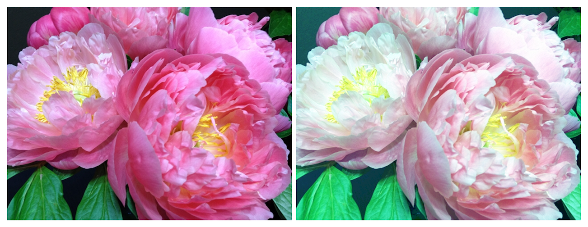

# Reading From and Writing to Core Video Pixel Buffers

Transfer image data between Core Video pixel buffers and vImage buffers to integrate vImage operations into a Core Image workflow

## Overview

vImage supports reading from and writing to Core Video pixel buffers. This sample implements a histogram equalization technique using vImage, then makes that technique accessible to Core Image workflows by sublassing `CIImageProcessorKernel`. An image processor kernel uses Core Video pixel buffers for input and output, so you must convert vImage buffers to and from `CVPixelBuffer` objects.

The example below shows an image before (on left) and after (on right) histogram equalization:



This sample walks you through the steps for reading from and writing to Core Video pixel buffers:

1. Defining an equalization image processor kernel.
2. Creating the source buffer.
3. Creating the destination buffer.
4. Applying the histogram equalization.
5. Writing the equalization result to the output.
6. Applying the equalization operation to an image.

## Define an Equalization Image Processor Kernel

First, create the outline of your image processor kernel.

Create a `vImage_CGImageFormat` structure that represents your image format; for example, an image that contains four 8-bit channels. The image processor kernel supports `kCIFormatR8`, `kCIFormatBGRA8`, `kCIFormatRGBAh`, and `kCIFormatRGBAf` input and output formats. Override `outputFormat` and `formatForInput(at:)` to return `kCIFormatBGRA8` to match the `bitmapInfo` property of your format.

Equalization happens inside the processor kernel's `process(with:arguments:output:)` function. The guard statement ensures that there is a valid input, and that both the input and output have a non-`nil` Core Video pixel buffer.

This code shows the basic structure of your image processor kernel:

``` swift
class EqualizationImageProcessorKernel: CIImageProcessorKernel {
    
    enum EqualizationImageProcessorError: Error {
        case equalizationOperationFailed
    }
    
    static var format = vImage_CGImageFormat(
        bitsPerComponent: 8,
        bitsPerPixel: 32,
        colorSpace: nil,
        bitmapInfo: CGBitmapInfo(rawValue: CGImageAlphaInfo.last.rawValue),
        version: 0,
        decode: nil,
        renderingIntent: .defaultIntent)
    
    override class var outputFormat: CIFormat {
        return CIFormat.BGRA8
    }
    
    override class func formatForInput(at input: Int32) -> CIFormat {
        return CIFormat.BGRA8
    }
    
    override class func process(with inputs: [CIImageProcessorInput]?,
                                arguments: [String: Any]?,
                                output: CIImageProcessorOutput) throws {
        
        guard
            let input = inputs?.first,
            let inputPixelBuffer = input.pixelBuffer,
            let outputPixelBuffer = output.pixelBuffer else {
                return
        }
```

## Create the Source Buffer

Create and populate the source vImage buffer with image data from the first input of the image processor kernel:

1. Create a description of the input pixel buffer format with `vImageCVImageFormat_CreateWithCVPixelBuffer(_:)`. This function returns an unmanaged object reference, and `takeRetainedValue()` returns a managed `vImageCVImageFormat` instance for use in step 3.
2. Set the color space of the `vImageCVImageFormat` instance.
3. Initialize the source buffer and populate it with the image data from the input pixel buffer.

You're responsible for releasing the buffer's memory after you're finished with it. To ensure that the buffer's data is properly freed—even if the function exits early—the free function is deferred.

This code shows how to initialize the source buffer:

``` swift
var sourceBuffer = vImage_Buffer()

let inputCVImageFormat = vImageCVImageFormat_CreateWithCVPixelBuffer(inputPixelBuffer).takeRetainedValue()
vImageCVImageFormat_SetColorSpace(inputCVImageFormat,
                                  CGColorSpaceCreateDeviceRGB())

var error = kvImageNoError

error = vImageBuffer_InitWithCVPixelBuffer(&sourceBuffer,
                                           &format,
                                           inputPixelBuffer,
                                           inputCVImageFormat,
                                           nil,
                                           vImage_Flags(kvImageNoFlags))

guard error == kvImageNoError else {
    throw EqualizationImageProcessorError.equalizationOperationFailed
}
defer {
    free(sourceBuffer.data)
}
```

## Create the Destination Buffer

Creating the destination buffer is similar to creating the source buffer, with one exception: You don't initialize the destination with the contents of a pixel buffer. Rather, you use `vImageBuffer_Init(_:_:_:_:_:)` to allocate the correct amount of memory for the image dimensions and number of bits per pixel.

The following code shows how to initialize the destination buffer:

``` swift
var destinationBuffer = vImage_Buffer()

error = vImageBuffer_Init(&destinationBuffer,
                          sourceBuffer.height,
                          sourceBuffer.width,
                          format.bitsPerPixel,
                          vImage_Flags(kvImageNoFlags))

guard error == kvImageNoError else {
    throw EqualizationImageProcessorError.equalizationOperationFailed
}
defer {
    free(destinationBuffer.data)
}
```

## Apply Histogram Equalization

With the source and destination buffers initialized, you perform the histogram equalization operation. Equalization transforms an image so that it has a more uniform histogram, adding detail to low-contrast areas of an image.

Because your image processor kernel consumes and produces images consisting of four 8-bit channels, use the `vImageEqualization_ARGB8888(_:_:_:)` function. This function works equally well on all channel orderings; for example, RGBA or BGRA.

``` swift
error = vImageEqualization_ARGB8888(
    &sourceBuffer,
    &destinationBuffer,
    vImage_Flags(kvImageLeaveAlphaUnchanged))

guard error == kvImageNoError else {
    throw EqualizationImageProcessorError.equalizationOperationFailed
}
```

## Write the Equalization Result to the Output

With the destination buffer populated with the equalization result, you're ready to write the destination buffer's contents to the output pixel buffer. The `vImageBuffer_CopyToCVPixelBuffer(_:_:_:_:_:_:)` function copies the contents of a vImage pixel buffer to a Core Video pixel buffer.

``` swift
let outputCVImageFormat = vImageCVImageFormat_CreateWithCVPixelBuffer(outputPixelBuffer).takeRetainedValue()
vImageCVImageFormat_SetColorSpace(outputCVImageFormat,
                                  CGColorSpaceCreateDeviceRGB())

error = vImageBuffer_CopyToCVPixelBuffer(&destinationBuffer,
                                         &format,
                                         outputPixelBuffer,
                                         outputCVImageFormat,
                                         nil,
                                         vImage_Flags(kvImageNoFlags))

guard error == kvImageNoError else {
    throw EqualizationImageProcessorError.equalizationOperationFailed
}
```

## Apply the Equalization Operation to an Image

Call the  `apply(withExtent:inputs:arguments:)` method to generate a `CIImage` instance based on the output of the processor's `process(with:arguments:output:)` function. This code shows how you can display an image with a histogram equalization operation applied:

``` swift
func applyFilter() {
    let image = #imageLiteral(resourceName: "Flowers_2.jpg")
    
    if let ciImage = CIImage(image: image),
        let result = try? EqualizationImageProcessorKernel.apply(
            withExtent: ciImage.extent,
            inputs: [ciImage],
            arguments: nil) {
        imageView.image = UIImage(ciImage: result)
    }
}
```
